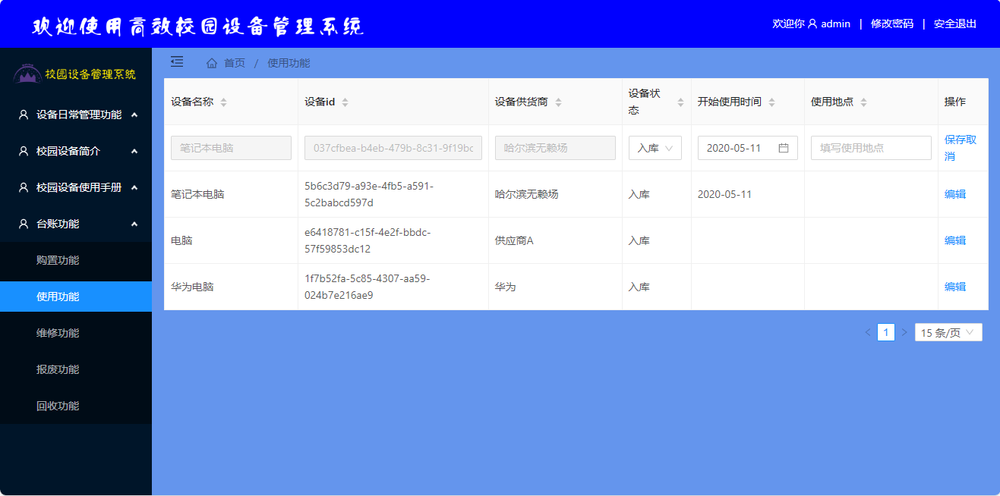
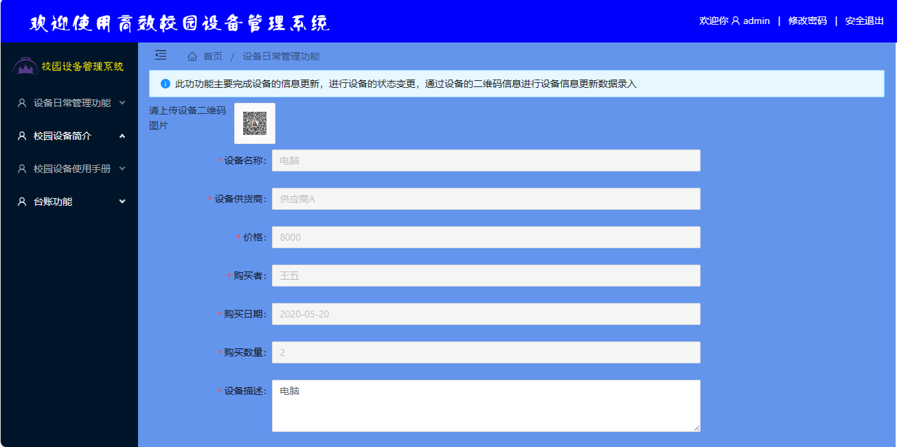

<h1 align="center">31.基于springboot的高校校园设备管理系统</h1>

- <b>完整代码获取地址：从戎源码网 ([https://armycodes.com/](https://armycodes.com/))</b>
- <b>技术探讨、资料分享，请加QQ群：692619798</b> 
- <b>作者微信：19941326836  QQ：952045282</b> 
- <b>承接计算机毕业设计、Java毕业设计、Python毕业设计、深度学习、机器学习</b>
- <b>选题+开题报告+任务书+程序定制+安装调试+论文+答辩ppt 一条龙服务</b>
- <b>所有选题地址 ([https://github.com/YuLin-Coder/AllProjectCatalog](https://github.com/YuLin-Coder/AllProjectCatalog)) </b>

## 项目介绍

基于springboot的高校校园设备管理系统：前端 angular，后端 spring, mybatis，校园设备的日常管理、使用手册维护、台账等功能。

## 主要功能

- 基本功能：登录、注册、安全退出、密码修改
- 设备日常管理功能：上传二维码，此功功能主要完成设备的信息更新，进行设备的状态变更，通过设备的二维码信息进行设备信息更新数据录入
- 校园设备简洁：设备列表查询、设备简介信息展示、信息编辑
- 校园设备使用手册：手册列表查询、下载设备手册、查看设备二维码信息
- 购置功能：此功功能主要完成设备的信息录入，设备购买信息录入，请先完成设备操作手册上传
- 使用功能：设备使用列表（设备名称、设备id、设备供货商、设备状态入库、开始使用时间、使用地点)、信息编辑
- 维修功能：维修列表、设备状态修改（状态范围有限制）
- 报废功能：报废列表、设备状态修改（状态范围有限制）
- 回收功能：回收列表、设备状态可改为入库或维修

## 环境

- <b>IntelliJ IDEA</b>

- <b>Mysql 5.7</b>

- <b>node 12.14.0</b>

- <b>JDK 1.8</b>

## 运行截图

